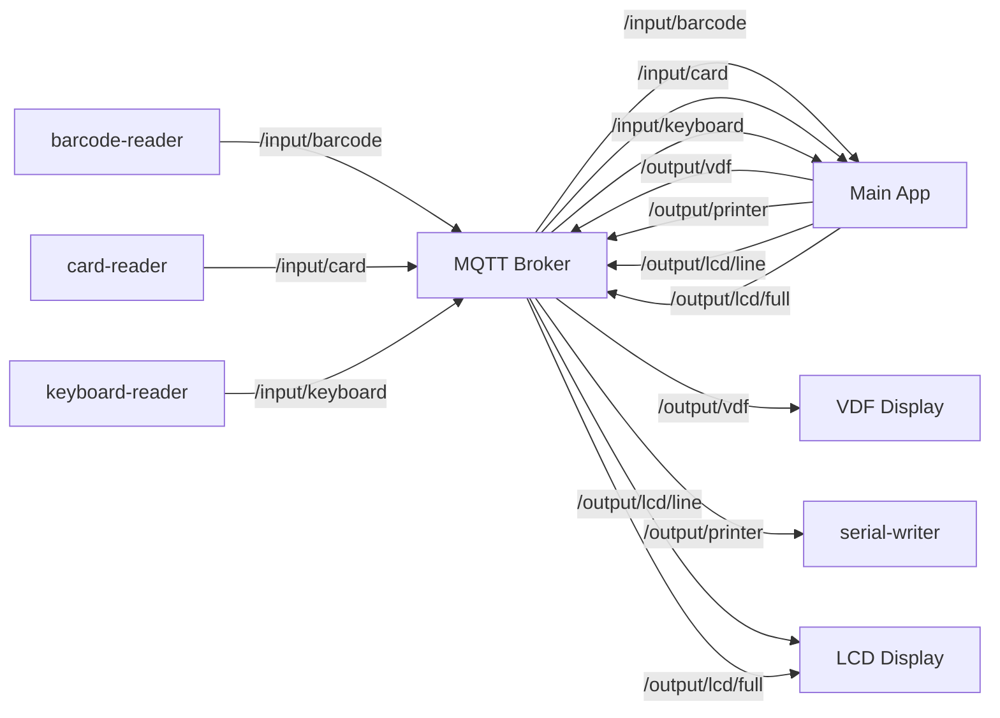

# DIY Cash Register Toy

A cash register modified to be used by children

## Message Flow Chart

```mermaid
flowchart LR
    BR[barcode-reader] --> |/input/barcode| M[MQTT Broker]
    CR[card-reader] --> |/input/card| M
    KEY[keyboard-reader] --> |/input/keyboard| M
    M --> |/input/barcode| MA[Main App]
    M --> |/input/card| MA
    M --> |/input/keyboard| MA
    MA --> |/output/vdf| M
    M --> |/output/vdf| VDF[VDF Display]
    MA --> |/output/printer| M
    M --> |/output/printer| SW[serial-writer]
    MA --> |/output/lcd/line| M
    MA --> |/output/lcd/full| M
    M --> |/output/lcd/line| LCD[LCD Display]
    M --> |/output/lcd/full| LCD[LCD Display]
```
